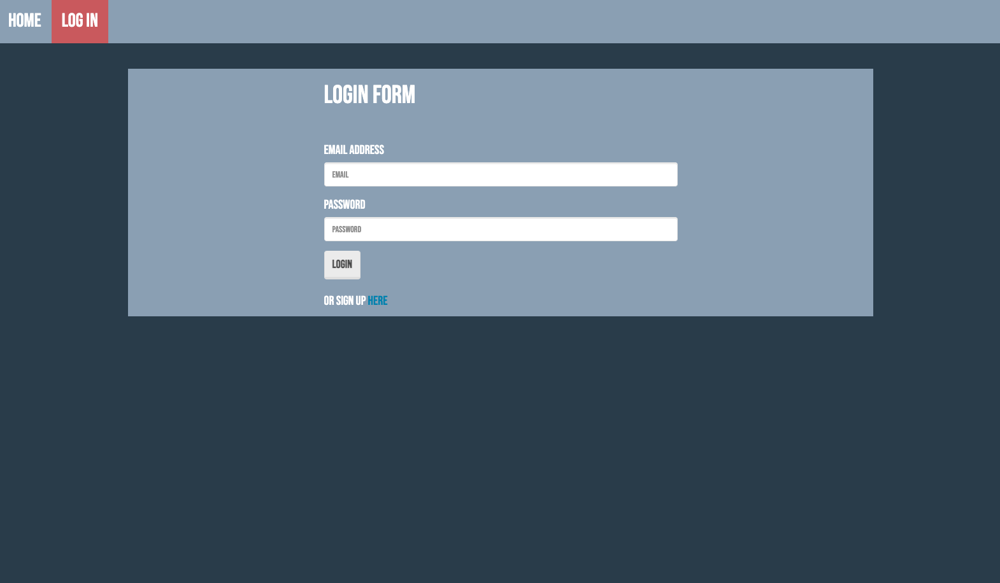
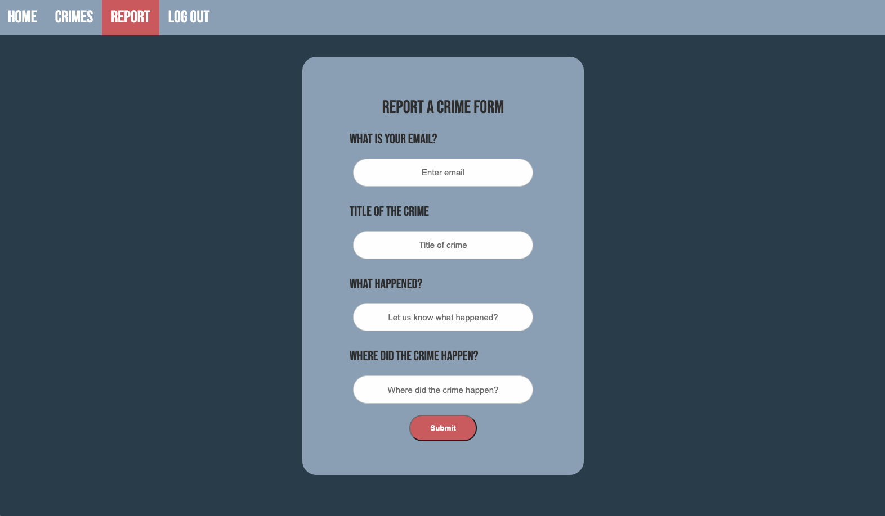
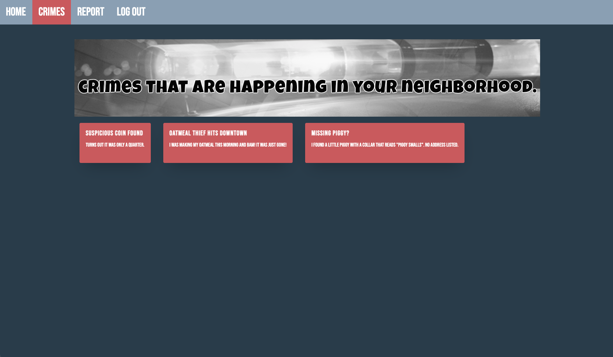

# Project 2: See Something, Say Something

## Description
The user is able to visit the deployed website and is prompted to sign up or log in. Once logged in, the user is able to submit a crime report that records such details as where the crime occurred (location-specific), what crime was committed, and the user's email. Once the user-generated crime report is submitted to the database, it is then posted on the Crimes page. The user is also able to view crimes that have been reported near their specific location (using Google Maps).

## Table of Contents
* [User Story](#user-story)
* [Installation](#installation)
* [Usage](#usage)
* [Deployed Website](#deployed-website)
* [Repository](#repository)
* [Future Development](#future-development)
* [Technology Used](#technology-used)
* [Questions](#questions)

## User Story
```
AS A dutiful and/or nosey citizen

I WANT TO be able to report crimes, as well as browse crimes reported by other citizens, that are specific to my current location

SO THAT I may be well-informed about the safety of my general surroundings.
```

## Installation
To install necessary dependencies, run the following command.
````bash
npm i
````

## Usage
Visit the website (linked below) sign up or log in, and start submitting crimes!






## Deployed Website
[See Something, Say Something](https://fierce-mountain-61777.herokuapp.com/)

## Repository
[Project02_Crime_Reporting](https://github.com/KirkpatrickPaul/Project02_Crime_Reporting)

## Future Development
* Make the app available globally, rather than specifically directed at the KC Metro area.
* Reconfigure app to handle a larger amount of traffic (i.e. limit crime cards).
* Categorize crimes so that they can be searched and sorted.
* "Crimes Near Me" functionality rather than wide scale database.
* Integration with social media(s).
* Graph takes in submitted information and adjusts accordingly.
* Ability to choose color scheme depending on the user.

## Technology Used
* Google Maps API
* Google Places API
* Jaws DB
* NODE.JS 
* Heroku 
* MySQL 
* Sequelize
* Charts.js 
* Express

## Questions
If you have any questions about the repo, please open an issue or contact us directly: 
* Paul Kirkpatrick ([radicalturnip@gmail.com](radicalturnip@gmail.com))
* Seth Glenn ([sbgees@yahoo.com](sbgees@yahoo.com))
* Anthony Gamon ([anthonygamon@icloud.com](anthonygamon@icloud.com))
* Kelsey Eckelberry ([kelseyeckelberry@gmail.com](kelseyeckelberry@gmail.com))


You can check out more of our work at: 
* [KirkpatrickPaul](https://github.com/KirkpatrickPaul)
* [sethglenn](https://github.com/sethglenn)
* [AnthonyGamon](https://github.com/AnthonyGamon)
* [kelseyeckelberry](https://github.com/kelseyeckelberry) 
